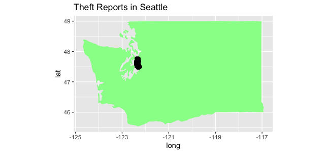
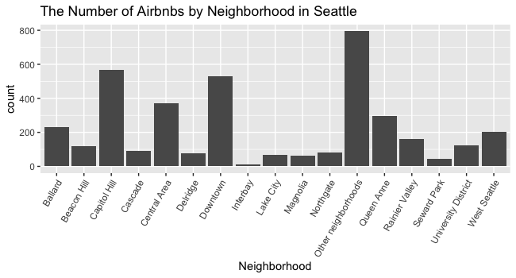

## How Seattle Crime Rates Affect a User's Decision to Book an Airbnb
Allison J Bennett, Nick M Hebert, Tushar Poddar, Mariella Gauvreau   
Project: Airbnb Locations vs. Crime Rates

Info-201: Technical Foundations of Informatics  
The Information School  
University of Washington  
Autumn 2019

#### 1.0 Introduction   
  **1.1** Problem Situation.  
  Airbnb currently has over 150 million users worldwide, many of them booking in metropolitan areas like New York, Washington D.C, and Seattle. Every person booking through Airbnb wants to make the most of their vacation by finding a place to stay that meets all of their preferences and financial needs. Sometimes this means finding a place to stay with an optimal location to tourist attractions. This comes with safety risks in largely populated areas. It is important for users to know all of these safety risks when booking to ensure the quality of customer care given by Airbnb.  

  **1.2** What is the problem?  
  Airbnb users need to be informed of the crime rates in the locations in which they are looking to stay. They are susceptible to choosing a place to stay that is filled with crime without this information which may lead them to unforeseen danger. Because crime rates are higher in big cities, especially in areas where many tourist attractions are located, this becomes particularly relevant to Airbnb users.  

  **1.3** Why does it matter?  
  The growth of Airbnb since the company has first launched is astounding. As more people book with Airbnb, they need to be able to compare listings based on as much information as possible. The quality of someone's experience when booking with Airbnb is determined by their entire vacation, not just by their experience with booking. A vacation can turn unsafe if a person and their family are faced with crime. There is an ethical responsibility for these individuals to be as informed as possible about this possible crime so that they can be better prepared during their stay.

  **1.4** How it will be addressed?  
  This problem will be addressed by creating a hub of information about Airbnb listings. At first, this will only include listings in Seattle and what the crime rates are in each listing's particular location. We will potentially include some other information about the listing’s location, like the proximity to popular attractions. This will allow users of Airbnb to have as much information as possible when booking so that they can weigh their options about which listing to book, potentially keeping them out of harms way during their travels.

#### 2.0 Research Questions   
  **Research Question 1**  
  Are people less likely to book an Airbnb if there is high crime activity in the location of the house?  
  **Research Question 2**  
  Is there less crime activity is locations with more Airbnb houses on the market?

#### 3.0 Possible data sets  
  **Data Set 1**  
  *Name:* Seattle Police Department 911 Incident Response  
  *Link:* https://www.kaggle.com/sohier/seattle-police-department-911-incident-response  
  *Number of Observations:* 1.4 million responses from 2009 onward  
  *Number of Attributes:* 19 different attributes  
  *Description:* This dataset is a record of all the police responses to 911 calls made in Seattle, Washington. This study looks at the incident location and type. This data will be used to see where there is a large amount of criminal activity in the Seattle region.

  **Data Set 2**   
  *Name:* Seattle Airbnb Open data  
  *Link:* https://www.kaggle.com/airbnb/seattle/  
  *Number of Observations:* Over 1 million observations  
  *Number of Attributes:* 92 different attributes  
  *Description:* This dataset is a record of Airbnb activity in the Seattle region. The dataset includes information on listings, the score of the listing, reviews, location, price, listing id, etc. This data will be used to see popular locations in Seattle for Airbnb houses.

#### 4.0 Information Visualizations

#### Figure 1.
This visualization demonstrates the amount of crime that occurs in the Seattle area. We would like to make this easier to view up close and look at specific neighborhoods.

#### Figure 2.
This plot shows the number of Airbnbs in Seattle by neighborhood. Our goal is to make this graph easier to read and add some color or other visual elements to make it easier to interpret.

#### 5.0 Team Coordination  
(a) Our group has found time on Sunday to meet for 2 hours. We will be changing the time on a week-to-week basis so that we can accommodate for everyone's schedules.  
(b) Goals:  
  - We would like to become more confident in working with large data sets and learn how to better represent the information that is pulled from them.  
  - We would like to learn how to best display our data so that it is easy to read by someone who does not know much about data analysis.

  We have not discussed individual roles yet, right now we are working together on all aspects of the project to see what we enjoy most.

(c) We will communicate weekly through slack and a group on Teams, both of which have already been created.  
(d) In order to give each other feedback on the work we will be doing, we will be allotting a portion of the time during our Sunday meetings to reviewing our work so far and making goals to help our group become more efficient and effective.

#### 6.0 Questions for Teaching Team
  No current questions for the teaching team.

#### 7.0 References
https://muchneeded.com/airbnb-statistics/  
https://ipropertymanagement.com/airbnb-statistics/
